# Notepad++ DLMS Parser 插件使用说明

## 简介

&emsp;&emsp;这是一个使用原生 C++ 编写的 Notepad++ 插件，用于从当前文档中提取、过滤并解析 HDLC、Wrapper、IEC 62056-21、DL/T 645等数据帧，同时支持 Security Suite 0 加密数据解析。

&emsp;&emsp;插件在 Notepad++ 中提供可停靠的解析面板，支持光标、选中、手动输入三种解析方式，解析结果以折叠树展示；解析和解密均在本机完成，不依赖在线解析服务。

  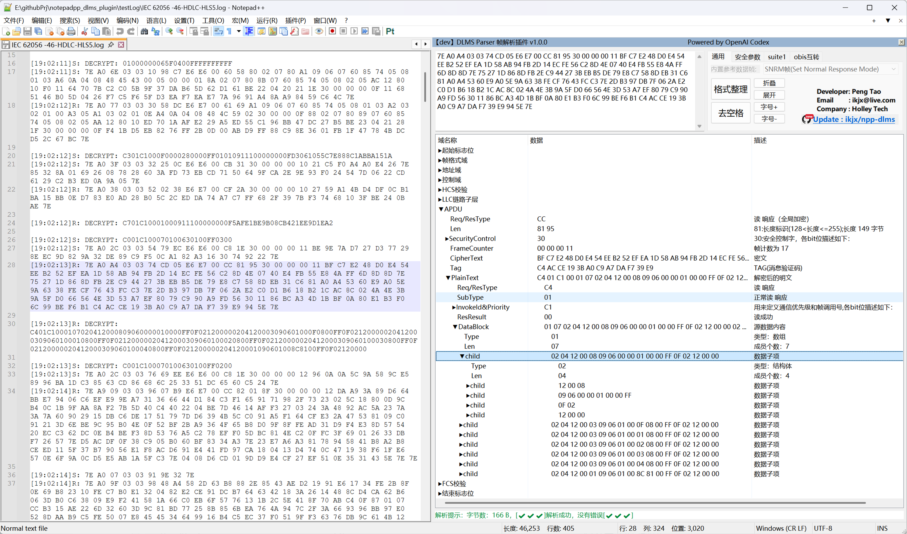
   
  图 0　面板总览

## 〇、目录

- [一、安装说明](#installation)
- [二、使用方法](#usage)
- [三、主要功能](#main-features)
- [四、其他功能](#other-features)
- [五、更新](#update)
- [六、隐私与运行环境](#privacy)

---

## 一、安装说明

#### 1 自动安装

解压压缩包，**解压后**双击 `Click on me to install.bat` 进行自动安装。安装成功后，按回车即可打开 Notepad++。

#### 2 手动安装

打开 Notepad++，依次点击顶部菜单“`插件`”→“`打开插件文件夹……`”，将与 Notepad++ 位数对应的 `DlmsParser` 插件文件夹复制到该目录，然后重启 Notepad++。

  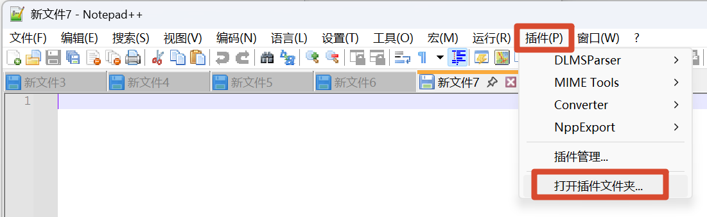
   
  图 1　打开 Notepad++ 插件文件夹

TIP: 插件目录应保持以下结构：`<安装目录>\plugins\DlmsParser\DlmsParser.dll`

## 二、使用方法

点击工具栏上的 **Pt** 图标，即可打开或隐藏解析面板。

  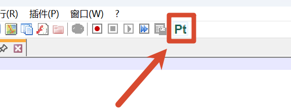
   
  图 2　点击 Pt 图标打开解析面板

#### 模式 1：光标解析

将鼠标光标放在需要解析的数据帧中，插件会自动解析光标所在或距离光标最近的可识别数据帧。

#### 模式 2：选中解析

选中完整的数据帧，或双击选中连续的十六进制数据，插件会优先解析选中的内容。

#### 模式 3：输入解析

在解析面板左上角的输入框中输入或粘贴数据帧，插件会自动解析。

  
   
  图 3　手动输入数据帧解析

## 三、主要功能

### 1 解析 IEC 62056-46 HDLC 数据帧

### 2 解析 IEC 62056-47 Wrapper 数据帧

  
   
  图 4　Wrapper 数据帧解析

### 3 解析 Security Suite 0 加密 APDU

- 需配置默认 EK、AK、BK，自动向前查找全文 SystemTitle，自动完成密文解析

- SecurityControl 置位为广播时，自动切换 BK 解密

- 解析结果跟随在密文 Tag 节点之后

  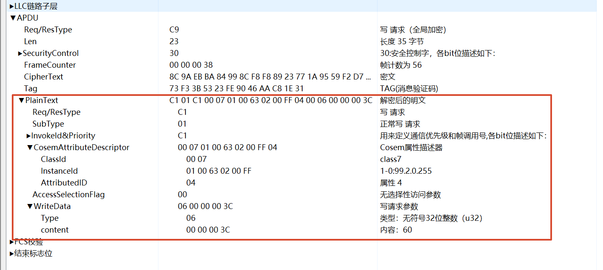
   
  图 5　解密结果跟随密文显示

### 4 ACSE APDU、xDLMS APDU 与 DLMS Data

  
   
  图 6　xDLMS APDU 解析

### 5 解析 IEC 62056-21 数据帧

  
   
  图 7　IEC 62056-21 数据帧解析

### 6 解析 DL/T 645-1997/2007 数据帧

  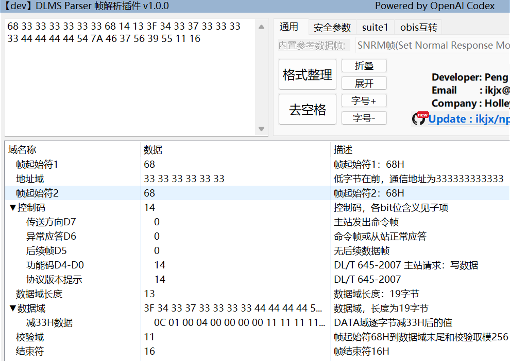
   
  图 8　DL/T 645 协议

### 7 解析万高 HDLC 扩展帧

  
   
  图 9　万高 HDLC 扩展帧解析

##### 

## 四、其他功能

- 解析树：点击第一列可展开/折叠子树，点击“**折叠**”和“**展开**”按钮可操作全局节点
- 解析树：双击第二、三列，可复制对应单元格内容
- 状态栏提示字节数和解析结果
- HDLC 帧的`地址域`、`控制域`、`帧格式域`支持记忆展开
- 双击面板顶栏，可从 Notepad++ 弹出面板，再次双击恢复嵌入

  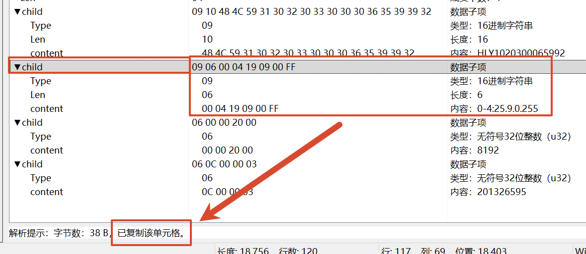
   
  图 11　复制解析结果单元格

- “**格式整理**”、“**去空格**”按钮可实现数据大写、增删空格，并重新解析
- “**格式整理**”按钮可实现 DLMS Data 的按行整理

  
   
  图 12　DLMS Data 按数据项换行整理

- 支持 OBIS 多种格式互转，输入三种 OBIS 格式中的任意一种，即可转换为另外两种格式；**正则表达式**可用于查找 OBIS

  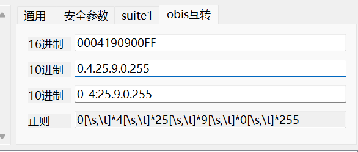
   
  图 13　OBIS 互转

  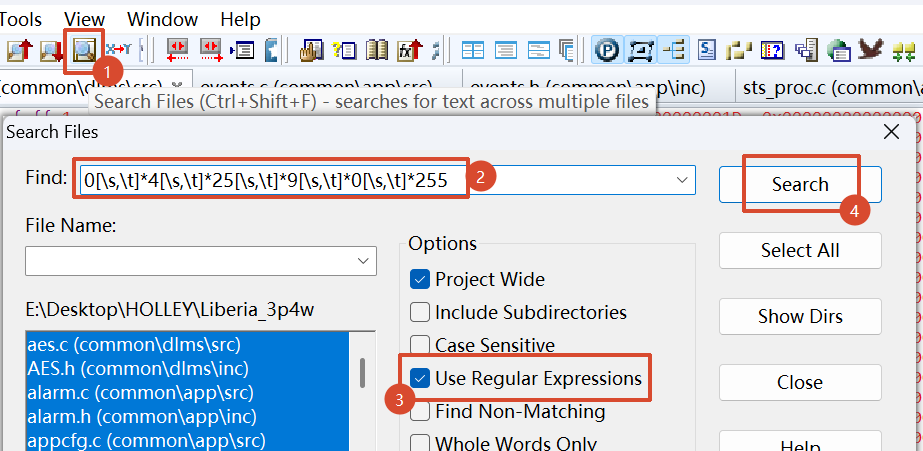
   
  图 14　Source Insight 中使用正则表达式查找 OBIS

  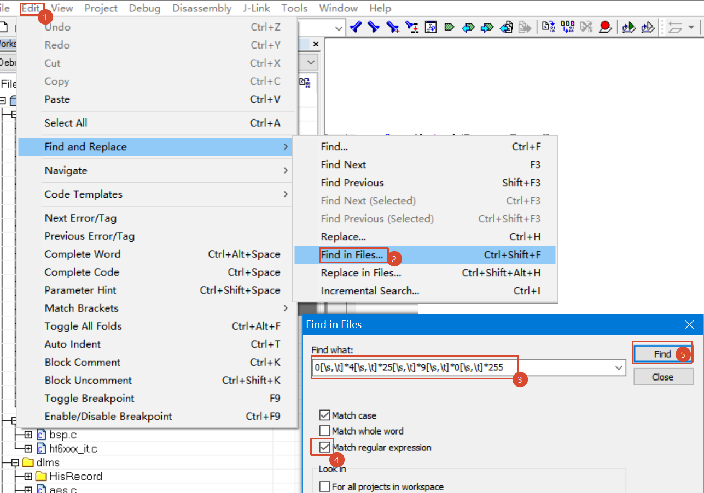
   
  图 15　IAR 中使用正则表达式查找 OBIS

- 支持 Security Options 默认参数配置，包括 SystemTitle、EK、AK、BK。
  
  - 插件安装目录的`DlmsParser.ini`文件可手动配置默认参数
  
  - Notepad++ 顶栏的“`插件`”→“`DLMSParser`”→“`Security Options...`”进行配置。

  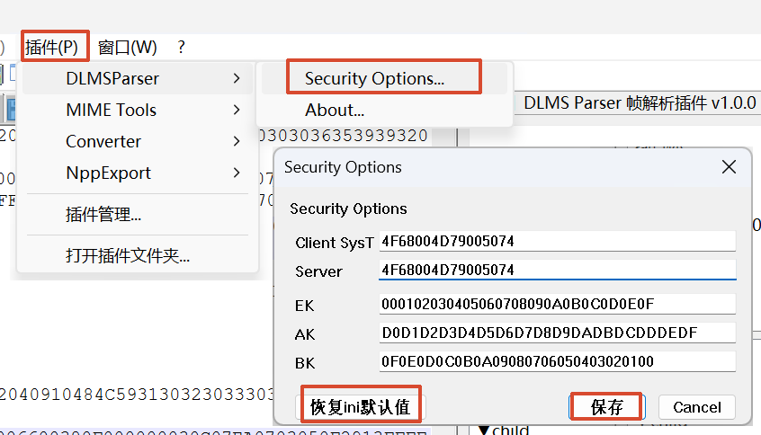
   
  图 16　安全参数配置

## 五、更新

- 首次打开解析面板时，插件会查询新版本。存在新版本时，显示红色 **`new`** 标记。

- 点击更新入口可进入下载页面，插件不会自动下载或安装更新。

  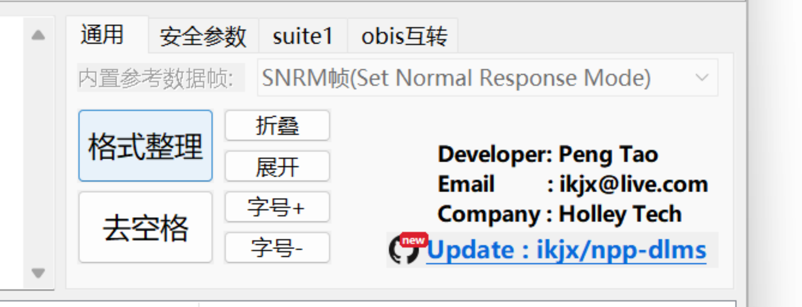
   
  图 17　新版本提醒

## 六、隐私与运行环境

- 报文提取、解析、格式化和解密均在本机完成，不会上传文档内容、报文或密钥。
- 联网行为仅用于检查版本；只有用户主动点击更新入口时才会打开浏览器。
- 支持 32 位和 64 位 Notepad++，插件位数必须与 Notepad++ 位数一致。
